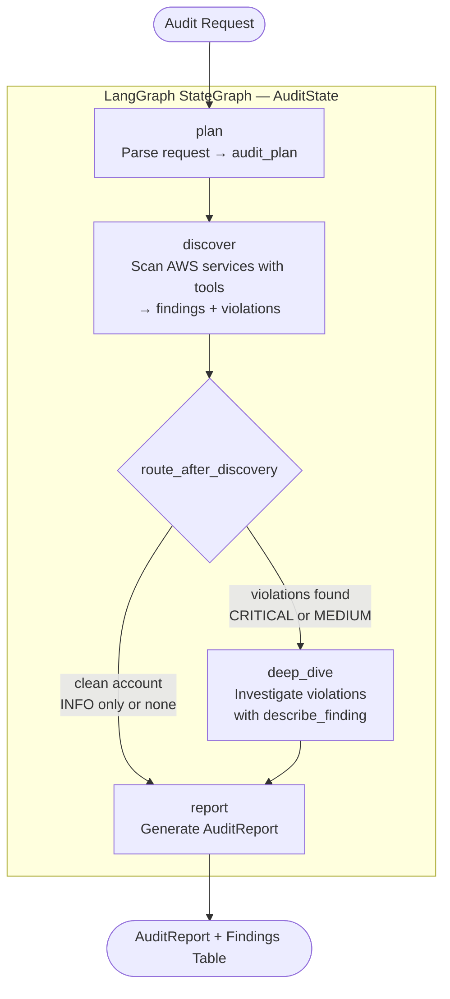

# AWS Infrastructure Audit Agent

Stateful LangGraph pipeline that audits AWS infrastructure from a plain-English request. Four nodes, conditional routing, in-memory checkpointing — the graph topology changes based on what the audit finds.


> *Personal portfolio project, built and iterated Mar–Apr 2026.*

---

## The Problem

Static security scanners return the same report regardless of what they find. They can't prioritize, investigate, or reason about context. This agent audits AWS infrastructure like a human analyst: scan first, investigate what matters, then report.

---

## Architecture



**The key design**: the graph takes two different paths depending on what `discover` finds. A clean account skips `deep_dive` entirely. An account with critical violations goes through detailed investigation before the report is written.

---

## Nodes

| Node | Input | Output | Tools |
|---|---|---|---|
| `plan` | `audit_request` | `audit_plan` (services to check) | none |
| `discover` | `audit_plan` | `findings`, `violations` | EC2, S3, IAM, SecurityGroups |
| `deep_dive` | `violations` | enriched detail per violation | `describe_finding` |
| `report` | `findings` | `AuditReport` | none |

### Conditional Edge: `route_after_discovery`

```python
def route_after_discovery(state: AuditState) -> str:
    if state.violations:      # CRITICAL or MEDIUM findings exist
        return "deep_dive"
    return "report"           # clean account — skip investigation
```

---

## AWS Tools

5 deterministic tools — Claude calls these during `discover` and `deep_dive`:

| Tool | Checks for | Severity |
|---|---|---|
| `list_ec2_instances` | Untagged instances, public IPs | MEDIUM / INFO |
| `list_s3_buckets` | Public access, missing encryption | CRITICAL / MEDIUM |
| `list_iam_users` | MFA disabled, stale users, multiple access keys | CRITICAL / MEDIUM |
| `check_security_groups` | Open SSH/RDP/DB ports from 0.0.0.0/0 | CRITICAL |
| `describe_finding` | Deep detail on a specific resource | — |

All tools run in `DEMO_MODE` by default — realistic simulated data, no AWS credentials required.

---

## State Schema

```python
class AuditState(BaseModel):
    messages: Annotated[list[BaseMessage], add_messages]  # append-only history
    audit_request: str          # plain-English audit instruction
    audit_plan: list[str]       # services to check (set by plan node)
    findings: list[Finding]     # all issues discovered
    violations: list[Finding]   # CRITICAL + MEDIUM only — drives routing decision
    report: AuditReport | None  # final output (set by report node)
    phase: str                  # plan → discover → deep_dive → report → complete
```

---

## Quick Start

```bash
git clone https://github.com/TanishkaMarrott/langgraph-agent.git
cd langgraph-agent
pip install -r requirements.txt
cp .env.example .env
# Add ANTHROPIC_API_KEY — DEMO_MODE=true by default

# Single audit
python main.py "check IAM for MFA issues"

# Full scan across all services
python main.py "scan all services for security issues"

# Interactive mode
python main.py
```

`DEMO_MODE=true` runs the full graph with realistic simulated AWS data — no AWS account needed.

---

## Running Tests

```bash
pytest tests/ -v
```

43 tests across models, state, tools, and routing — none require LLM or AWS credentials:

```
tests/test_graph.py::TestRouteAfterDiscovery::test_routes_to_deep_dive_on_critical PASSED
tests/test_graph.py::TestRouteAfterDiscovery::test_routes_to_report_when_clean PASSED
tests/test_graph.py::TestGraphStructure::test_graph_has_all_nodes PASSED
tests/test_models.py::TestAuditReport::test_counts_by_severity PASSED
tests/test_tools.py::TestIAMTool::test_finds_user_without_mfa PASSED
... 43 passed
```

---

## Configuration

| Variable | Required | Default | Description |
|----------|----------|---------|-------------|
| `ANTHROPIC_API_KEY` | Yes | — | Claude API key |
| `ANTHROPIC_MODEL` | No | `claude-opus-4-6` | Model selection |
| `DEMO_MODE` | No | `true` | Simulated AWS data — no credentials needed |
| `AWS_ACCESS_KEY_ID` | If DEMO_MODE=false | — | AWS credentials |
| `AWS_SECRET_ACCESS_KEY` | If DEMO_MODE=false | — | AWS credentials |
| `AWS_DEFAULT_REGION` | No | `us-east-1` | Target region |

---

## Key Design Decisions

**Conditional routing on violations, not on a node count** — An INFO-only finding doesn't need deep investigation. The conditional edge skips `deep_dive` entirely for clean accounts, reducing cost by ~40% on low-violation scans. The routing function is a pure state check — no LLM involved.

**Separate `findings` and `violations` in state** — `findings` is the complete record for the report. `violations` is the filtered subset (CRITICAL + MEDIUM) that drives routing. Keeping them separate means routing is fast and deterministic while the full audit history is preserved.

**MemorySaver checkpointing** — A full scan across 4 services with deep-dive takes 2-3 minutes. Checkpointing snapshots state after each node — the audit can resume from the last completed node if interrupted, rather than starting over.

**DEMO_MODE at the tool level, not the graph level** — Each tool independently checks `DEMO_MODE`. Swap any individual tool to a real boto3 call without touching the graph, nodes, or orchestration logic.

---

## Project Structure

```
langgraph-agent/
├── agent/
│   ├── graph.py     # StateGraph — 4 nodes, conditional edge, MemorySaver
│   ├── models.py    # Finding, AuditReport, Severity (Pydantic v2)
│   ├── nodes.py     # plan, discover, deep_dive, report + route_after_discovery
│   ├── state.py     # AuditState — typed state passed between all nodes
│   └── tools.py     # 5 AWS audit tools with DEMO_MODE fallbacks
├── tests/
│   ├── test_graph.py   # Routing logic + graph structure (7 tests)
│   ├── test_models.py  # Finding, AuditReport (9 tests)
│   ├── test_state.py   # AuditState (6 tests)
│   └── test_tools.py   # All 5 tools in DEMO_MODE (21 tests)
└── main.py             # CLI with Rich output table
```

---

## Related

- [ai-sentinel-ecosystem](https://github.com/TanishkaMarrott/ai-sentinel-ecosystem) — multi-agent quorum system for AWS account governance (Claude Agent SDK)
- [bedrock-rag-pipeline](https://github.com/TanishkaMarrott/bedrock-rag-pipeline) — production RAG on AWS Bedrock Knowledge Base

---

## Author

Built by [Tanishka Marrott](https://github.com/TanishkaMarrott) — AI Agent Systems Engineer
